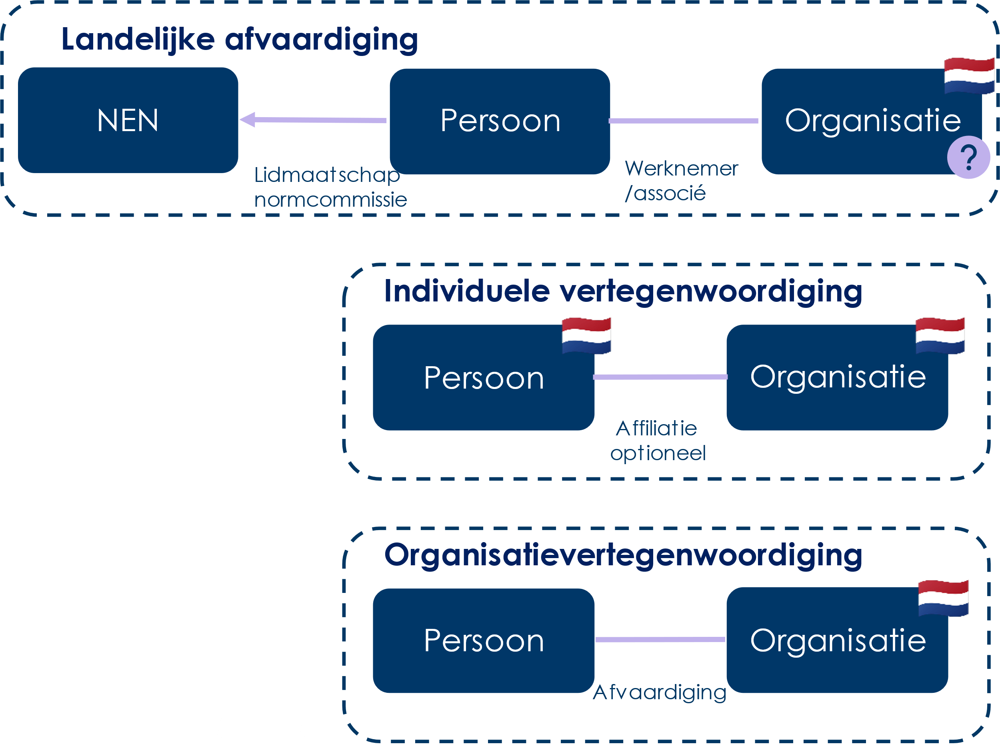

# Methode van onderzoek

**De onderzoeksmethode naar de Nederlandse participatie in Europese- en internationale standaardisatie, is beschreven in een separaat document.**

Deze bevat:

- Een verdere uitwerking van de herkomst van de gegevens van participaties.  

- Een verdere uitwerking van de resultaten per SDO.

- De uitgesplitste cijfers over de participatie.

## Kwantitatieve gegevensparticipatie

Voor de kwantitatieve analyse van de participatie van Nederlandse organisaties in internationale normalisatieprocessen zijn gegevens verzameld van de websites en portalen van de SDO’s en is een dataset beschikbaar gesteld door het Forum Standaardisatie.

Figuur 1. Representatievormen voor Nederlandse vertegenwoordiging

De beschikbaarheid van gegevens varieerde per SDO. Voor een overzicht hiervan, zie de (afzonderlijke) methodologische rapportage.

Om de participatie van alle SDO’s te kunnen vergelijken is een uniform datamodel opgesteld. De gegevens van alle SDO’s zijn hierin verwerkt:

- *Optioneel: Persoon X*

- *Optioneel: Namens organisatie Y*

- *Is lid van/vervult formele rol/ neemt deel aan overleg/dient contributie in/stemt*

- *Bij werkgroep/commissie Z*

- *Optioneel: Als \[rol\]van verzamelde*

- *Optioneel: Op datum \[dd-mm-jjjj\]*

Het Nederlands belang is gekoppeld aan de betreffende organisatie namens welke een persoon participeert. Hiervoor is een ledenlijst van de NEN gebruikt, uitgebreid met namen van Nederlandse bedrijven die in de dataset voortkomen. Er zijn twee modellen mogelijk om het Nederlands belang te bepalen:

1.  De organisatie is met vermelding van land geregistreerd bij de SDO.  
    In dat geval wordt de landvermelding overgenomen, maar wordt de organisatie ook opgenomen in de organisatielijsten, zodat participatie aan andere SDO’s hiermee verrijkt kan worden.

2.  De organisatie moet op naam gematcht worden en gekoppeld worden aan een organisatie uit de organisatielijsten.  
    Wanneer er een match is, kan geconcludeerd worden dat er sprake is van vertegenwoordiging van een Nederlands belang.

De tweede route introduceert een complexiteit wanneer sprake is van multinationals, die relatief vaak als Nederlands belang worden aangemerkt omdat zij lid zijn van NEN en dus ook via hun Nederlandse belang participeren. Hierop gaan wij bij de bespreking van de resultaten dieper in.

## Interviews

Voor dit deel van het onderzoek werden connecties gelegd met 34 organisaties via NEN, leden van het Forum Standaardisatie en het eigen netwerk van ICTU. Met de geïnterviewden is afgesproken dat ze anoniem blijven. Ze ontvingen vooraf de te bespreken onderwerpen.

De interviews, die gemiddeld 60 minuten duurden, vonden plaats tussen mei en december 2024. Ze werden online afgenomen en automatisch getranscribeerd. Vervolgens zijn samenvattingen geautomatiseerd gegenereerd en hebben de onderzoekers handmatig per samenvatting tekstdelen gecategoriseerd op basis van de onderwerpen die gerelateerd zijn aan onderzoeksvragen 2 en 3.

